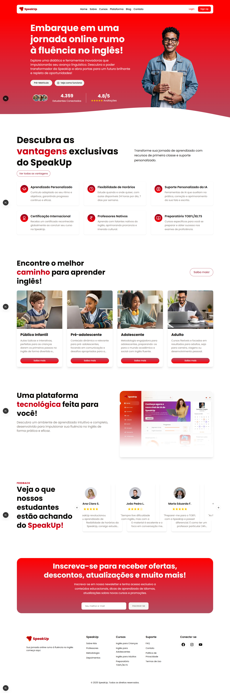
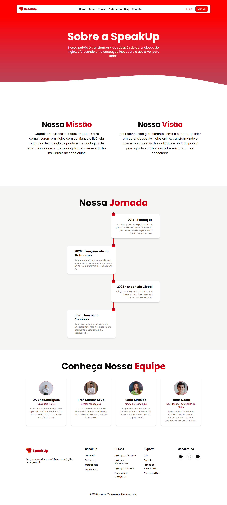
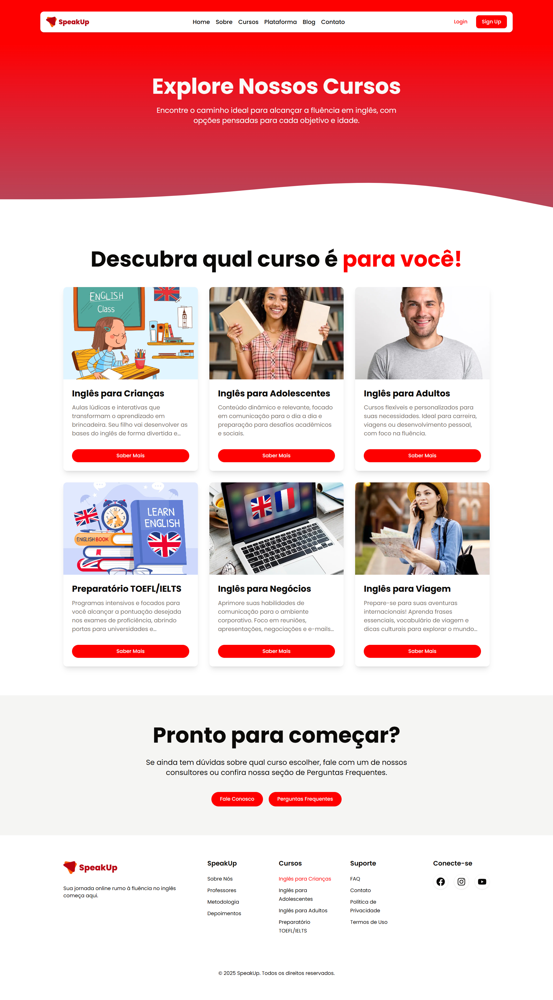
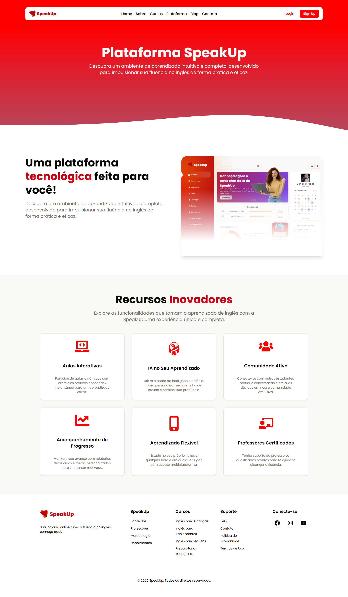
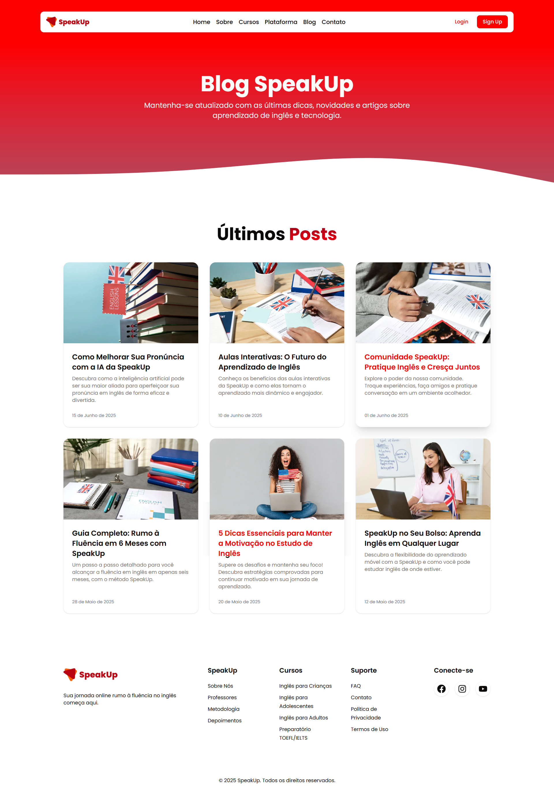
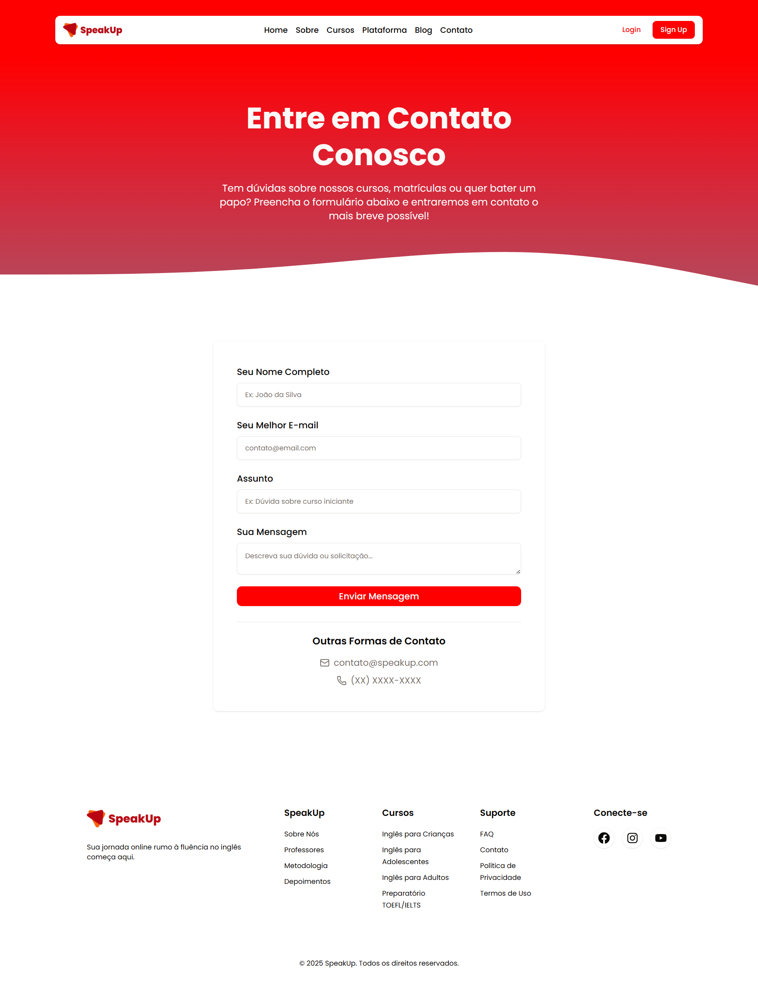

# SpeakUp - Escola de Inglês Online (Projeto para Portfólio)

Bem-vindo ao repositório do projeto **SpeakUp**! Este é um site de demonstração para uma escola de inglês online fictícia, desenvolvido com o objetivo de apresentar minhas habilidades em desenvolvimento web moderno. O projeto foca em uma interface de usuário intuitiva, responsiva e altamente interativa.

---

## 🚀 Visão Geral do Projeto

O SpeakUp é um front-end moderno e elegante, projetado para atrair e engajar potenciais alunos de inglês. Ele oferece uma experiência de navegação fluida e informativa, destacando os diferenciais da escola, como sua metodologia, equipe de professores e depoimentos de alunos satisfeitos.

Este projeto foi construído do zero, com uma forte ênfase na **qualidade do código**, **performance**, **acessibilidade** e **responsividade**, garantindo que a aplicação funcione perfeitamente em qualquer dispositivo.

---

## ✨ Tecnologias Utilizadas

Este projeto demonstra proficiência em um conjunto robusto de tecnologias web modernas e ferramentas de desenvolvimento.

* **Next.js:** Framework React de ponta para aplicações full-stack, utilizado para **renderização no lado do servidor (SSR)** e **geração de sites estáticos (SSG)**, otimizando performance e SEO.
* **React.js:** Biblioteca JavaScript para construção de interfaces de usuário dinâmicas e reativas.
* **TypeScript:** Superset do JavaScript que adiciona tipagem estática, proporcionando maior robustez, manutenibilidade e menos erros em tempo de desenvolvimento.
* **Tailwind CSS:** Framework CSS utilitário que permite construir designs complexos e responsivos de forma rápida e eficiente, mantendo o controle total sobre o estilo.
* **Shadcn UI:** Coleção de componentes de interface de usuário baseados no Radix UI e estilizados com Tailwind CSS. Garante componentes acessíveis, personalizáveis e de alta qualidade.
* **Radix UI:** Biblioteca de componentes primitivos sem estilo para React, focada em acessibilidade e flexibilidade, sobre a qual o Shadcn UI é construído.
* **Framer Motion:** Biblioteca poderosa para animações no React, utilizada para criar transições e efeitos visuais suaves e impactantes, melhorando a experiência do usuário.
* **Lucide React (React Icons):** Biblioteca de ícones simples e consistentes, facilmente personalizáveis e otimizados para uso em React.

---

## 🌟 Recursos e Funcionalidades

* **Design Responsivo:** Layouts que se adaptam perfeitamente a diferentes tamanhos de tela (desktop, tablet, mobile).
* **Animações Suaves:** Utilização de Framer Motion para animações de scroll e transições de elementos, tornando a experiência mais dinâmica.
* **Componentes Reutilizáveis:** Estrutura modular com componentes bem definidos para facilitar a manutenção e escalabilidade.
* **Páginas Essenciais:**
    * **Home:** Visão geral da escola.
    * **Sobre Nós:** Detalhes sobre a missão, visão e história da SpeakUp.
    * **Professores:** Apresentação da equipe de ensino.
    * **Metodologia:** Explicação da abordagem pedagógica.
    * **Depoimentos:** Prova social com testemunhos de alunos.
    * **FAQ:** Perguntas frequentes com componente Accordion do Shadcn UI para usabilidade.
    * **Cursos:** Página de visão geral dos cursos e páginas de detalhe para cada categoria (Crianças, Adolescentes, Adultos, Preparatórios).
* **Otimização de Imagens:** Uso do componente `next/image` para lazy loading e otimização de imagens, resultando em carregamento mais rápido.

---

## 📸 Previews das Páginas

Aqui estão algumas prévias das principais páginas do projeto para você ter uma ideia do design e da funcionalidade.

### Página Inicial

---

## 💡 Contribuições e Feedback

Este projeto foi desenvolvido como parte do meu portfólio. Sugestões e feedback são sempre bem-vindos! Se você tiver alguma dúvida ou quiser discutir o projeto, sinta-se à vontade para entrar em contato.

---

**Desenvolvido por [DosSantosDev2022/GitHub](https://github.com/DosSantosDev2022)**